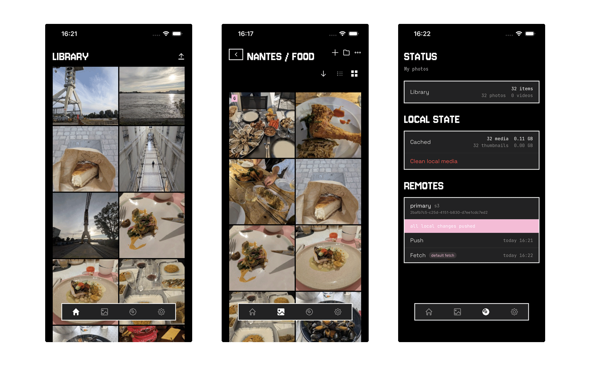

  

  

Lasco is a client-side app to back up and sync your photo library to multiple storage solutions like S3 and soon, NAS, USB drives, or any file server.

Learn more at [getlasco.app](https://getlasco.app).

## Main features

- Photo backup / storage app
- Client-side only
- End-to-end encrypted
- Multi-destination
- Conflict-free sync

## How it works

All logic runs on your device. Lasco encrypts your photos and videos locally, then pushes them to whichever remote storage you configure. Fetch from any of them to restore or get modifications made by other users of your library.

## Format specification

I am trying to document in a useful way the way it works and the way it is implemented: [getlasco.app/docs/format-specification/motivations](https://getlasco.app/docs/format-specification/motivations)

## License

GPL v3

## Contributing

I don't accept contributions for now.
